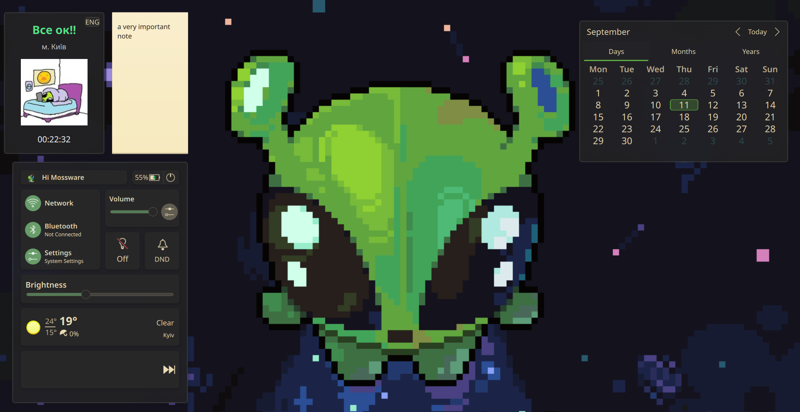

# Air Raid Alert Widget (mossware.airraidalert) 

A compact KDE Plasma 6 widget to display **air raid alerts** for Kyiv in real time.  

---

<p align="center">
  
</p>
<p align="center"><em>Kyiv Air Raid Alert Widget</em></p>

---

## ⚡ Features

- Shows **active air raid alerts** with visual cues (red text + alert image).  
- Displays **current system time**.  
- Language toggle: **Ukrainian / English**.  
- Default location is **Kyiv**, manually changeable via `locationUID`.  
- **Designed for Plasma 6** (may not work on Plasma 5).

---

## 🛠️ Setup

1. Clone this repository:

```bash
git clone https://github.com/<your-username>/mossware.airraidalert.git
```
2. Copy the folder to your Plasma plasmoids directory (if not already there):
   
```bash
cp -r mossware.airraidalert ~/.local/share/plasma/plasmoids/
```
3. Open KDE Add Widgets, search for Air Raid Alert, and add it to your desktop or panel.

## 🔧 Configuration

- **API Token:** You need your own token from [alerts.in.ua](https://devs.alerts.in.ua/)  
(fill in the request form with your use case).
Replace `<YOUR_API_TOKEN>` in `main.qml` with your token.

- **LocationUID:** Default is `31` (Kyiv).  
To use another city/region, change the `locationUID` manually.  
The full list of UIDs is available [here](https://devs.alerts.in.ua/).

## 🔄 Applying Changes

After making any changes to the widget (like adding your API token or changing the `locationUID`), you need to **restart Plasma** for the changes to take effect.  

---

## ⚠ About this widget

I made this specifically for **Kyiv**, where I live, so it’s tuned for my setup.  
If you want to use it for another location, you’ll need to **change the `locationUID` manually**.

Honestly, I made it mostly for myself, so it’s **not polished for general use**—but feel free to tinker with it.
